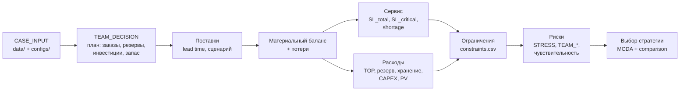

# 1. Архитектура расчёта и снабжения

## 1.1 Концептуальная модель

Предмет — планирование снабжения условного орбитального топливного узла криогенными компонентами (КРТ) для цислунарной транспортной системы на горизонте 2035–2040. Модель агрегированная: все каналы поставляют сопоставимый условный топливный ресурс в один узел; переменная цена канала уже включает доставку в узел (CASE_RULES §5). Класс модели — **network flow + inventory control** (единая логистическая система «поставки — склад — запасы — сроки — обслуживание спроса», по терминологии обзора Ho 2024), а не траекторная задача.

Конвейер расчёта (связь «решение → последствие»):

```
данные → решения → поставки → баланс → сервис → расходы → ограничения → риски → выбор
```



## 1.2 Блоки расчёта: входы, выходы, формулы, источник метода, границы

Формулы цитируются точно по `docs/CALCULATION_RULES.md` (далее CR, номер раздела).

### Блок 1. Данные (load_case / load_scenario / apply_scenario)

- **Входы:** `data/demand.csv`, `supply_sources.csv`, `storage_options.csv`, `investment_options.csv`, `constraints.csv`; сценарий из `configs/*.yaml` (BASE, MANDATORY_STRESS, TEAM_*).
- **Выходы:** валидированный `CaseData`; для сценария — новый `CaseData` с применёнными множителями (спрос, цены, фактические доли поставки, потолок потерь), исходный не мутируется.
- **Источник метода:** NASA-STD-7009B (трассируемость входов, явные допущения, воспроизводимость).
- **Границы:** множители BASE = 1.0; MANDATORY_STRESS изменять запрещено (CASE_RULES §4); комбинация с high-demand/геополитикой — только отдельный TEAM_* сценарий.

### Блок 2. Решения (план оператора, TEAM_DECISION)

- **Входы:** формат `plan_format.json`: `supply_orders` (source_id, period, ordered_volume_t), `capacity_reservations` (≤ capacity источника, prorata при неполном году), `investments` (EARTH_NEW buy_option 90 / exercise_option 270; LUNAR_ISRU fund_capex 1250 до 2038; ZBO fund_capex 180 не ранее 2036), `inventory_policy` (начальный запас с явным источником и оплатой в 2035), `emergency_contract` (если резерв контрактный).
- **Ключевое различение сущностей** (STARTER_README §10): `reserved ≠ ordered ≠ delivered ≠ served`; `capacity ≠ inventory`; контрактный emergency-резерв ≠ физический запас.
- **Выходы:** статически валидированный план (`validate_plan` — без расчёта).
- **Границы:** начальный запас не бесплатен и не учитывается дважды (либо I_start 2035-01, либо поставка месяца); подготовительные заказы оплачиваются в финансовом горизонте 2035 (units_and_conventions §3).

### Блок 3. Поставки (calculate_deliveries)

- **Входы:** заказы плана, lead times CASE_INPUT (A: 12 мес; B: 4 мес; C: 18–24 мес, политика 24 — TA-02; D: 1–2 мес после ввода, политика 2 — конвенция контракта; E: 6 недель = 42 дня — TA-03), конвенция «заказ в месяце M → поставка в M+L» (TA-04), `actual_delivery_share` сценария.
- **Формулы/правила (CR §10, §11, §14):**
  - BASE детерминирован: `delivered = planned`. Формула `Wrong for BASE: delivered = planned * reliability` — reliability в BASE **не умножается** (CR §11).
  - В MANDATORY_STRESS фактические доли Lunar-ISRU 55% (2038) / 75% (2039) применяются к plan-объёмам и **не умножаются повторно на reliability** (CR §11).
  - Emergency: годовой лимит 80 т/год + шестинедельный lead time; «штраф или денежная компенсация не создают физический ресурс» (CR §14); Emergency не может быть основой снабжения более двух последовательных лет (CR §14; рабочая трактовка «базовости» — TA-09).
- **Источник метода:** разнесение lead time по каналам как основа dual-sourcing-гибкости — класс решений, поддерживаемый Han et al. (2023) и Guo et al. (2025); пороговые политики dual sourcing — Federgruen, Liu, Lu (2022) (см. `03_methods_evidence_map.md`).
- **Границы:** reliability-коэффициенты живут только в отдельном риск-блоке WP3 с раскрытой интерпретацией (units_and_conventions §9).

### Блок 4. Материальный баланс и потери (calculate_inventory)

- **Формулы (CR §1–§3), цитата точно:**

  ```text
  I_end = I_start + Q_delivered - Losses - Q_served
  Shortage = max(0, Demand - Q_served)
  Throughput = gross inflow during the period
  Losses = Throughput * loss_rate
  ```

- **Правила:** `I_end >= 0` как физическое состояние; отрицательный inventory не используется как обозначение shortage (CR §1–2). Потери начисляются **один раз** на валовое поступление; повторное уменьшение closing inventory тем же коэффициентом — double counting, запрещён (CR §3).
- **Режимы хранения (CASE_INPUT):** Base storage 70 т, loss_rate 4.5%; ZBO 120 т, loss_rate 1.2%, CAPEX 180, +12 млн/год OPEX. Смена режима внутри года: поступления месяцев ≤ M−1 теряют 4.5%, с месяца M — 1.2%; дата ввода ZBO = месяц, следующий за месяцем платежа CAPEX (TA-05).
- **Проверки ёмкости (CR §13):** `physical_inventory <= active_storage_capacity` каждый месяц; переполнение — отдельное нарушение STORAGE_OVERFLOW с периодом и величиной excess (units_and_conventions §6).
- **Источник метода:** inventory control как ядро space logistics — Ho (2024); запасы как механизм, «мостирующий» lead time, capacity reservation как аналог виртуального запаса — Guo et al. (2025); физическая мотивация отдельного учёта криогенных потерь (boil-off) — Simonini et al. (2024); демонстратор ZBO-класса — RRM3 (Robotic Refueling Mission 3: four months zero boil-off methane storage by means of a cryocooler — сверено по `docs/sources_txt/`, Simonini et al. 2024).
- **Границы:** loss_rate 4.5%/1.2% — модельные коэффициенты CASE_INPUT, не универсальные реальные характеристики ZBO (SCIENTIFIC_BASIS §3).

### Блок 5. Сервис (calculate_service)

- **Формулы (CR §7), цитата точно:**

  ```text
  SL_total = served_total / demand_total
  SL_critical = served_critical / demand_critical
  ```

  BASE-минимумы ежегодно: `SL_total >= 0.97`, `SL_critical >= 0.99`.
- **Правила:** критический спрос входит в общий; `served_critical` входит в `served_total` — никогда не суммируются (CR §7). Аллокация при дефиците (TEAM_DECISION): сначала критический спрос, затем прочий (units_and_conventions §5). Division-by-zero при нулевом спросе должен быть определён реализацией явно (CR §7).
- **45-дневный резерв (CR §4), цитата точно:**

  ```text
  R_y = D_y * 45 / 365
  ```

  `D_y` — общий спрос соответствующего года **и сценария** (в стрессе — от стрессового спроса); физический запас проверяется на начало года; контрактный Emergency засчитывается только при доказанном покрытии периода ожидания 42 дня (units_and_conventions §6).
- **Границы:** в стрессе те же уровни SL — ориентиры устойчивости: нарушение показывается численно, исходные данные для его устранения не увеличиваются (units_and_conventions §9).

### Блок 6. Расходы (calculate_costs)

- **Формулы (CR §5, §6, §8, §9), цитата точно:**

  ```text
  Q_pay = max(Q_order, take_or_pay_share * Q_reserved_period)
  VariablePayment = price * Q_pay
  ReservationPayment = reservation_rate * annual_reserved_capacity * period_fraction
  TotalCost = Procurement + Reservation + Holding + FixedOPEX + CAPEX
  PV_t = CF_t / (1 + r)^(t - t0)
  ```

- **Правила:** минимальный оплачиваемый объём уже учтён внутри `max(...)` — TOP не добавляется вторым платежом (CR §5); месячный шаг не создаёт независимых месячных TOP-минимумов (CR §15); reservation prorate по доле года, не дублировать годовой платёж по месяцам (CR §6); Holding — 0.72 млн у.е./(т·год) × time-weighted средний физический запас (CR §8; метод усреднения — TA-08); выручки и стоимости срыва миссии в контрольном TotalCost нет (CR §8).
- **Дисконтирование:** r = 0.10 реальная, t0 = 2035, момент — конец года (TA-06, TA-07). Обоснование ставки: WACC космических проектов 11.5–13% по Sommariva et al. (2023), округление вниз до 10% — консерватизм сравнения; чувствительность 5–15% считает WP2. Все альтернативы — на одной ставке и базе цен (CR §9).
- **CAPEX (CR §12, units_and_conventions §8):** EARTH_NEW `90 + 270 = 360` — итоговая стоимость механизма, не третий платёж; лимиты hard: Σ CAPEX ≤ 1800 до 2037-12, ≤ 2800 до 2040-12; LUNAR_ISRU 1250 с дедлайном платежа 2037-12, канал D с 2038-01, +70 млн/год OPEX с 2038.
- **Источник метода:** сравнение Earth-vs-Lunar архитектур на общей экономической базе с анализом неопределённости (Monte Carlo) — Sommariva et al. (2023); дисциплина «цены защиты» против номинальной эффективности — Bertsimas & Sim (2004) при опциональном robust-анализе.
- **Границы:** экономика Луна/Земля из Sommariva — не готовый ответ кейса (SCIENTIFIC_BASIS §4).

### Блок 7. Ограничения (check_constraints)

- **Входы:** `constraints.csv` (CASE_INPUT): BASE_CRITICAL_SERVICE ≥ 0.99; BASE_TOTAL_SERVICE ≥ 0.97; CAPEX_2037 ≤ 1800; CAPEX_2040 ≤ 2800; RESERVE_45D ≥ 45 дней; EMERGENCY_BASE_STREAK ≤ 2 лет; STRESS_LOSS_LIMIT ≤ 0.02 (2038–2040, только MANDATORY_STRESS). Плюс проверки CR §13: `reserved_capacity <= source_capacity`, отбор ≤ контрактно доступного объёма, запас ≤ ёмкости.
- **Выходы:** каждая Violation — `rule_id, period, actual, limit, excess, message_ru` (core_api.md). Нарушение показывается как отдельный результат с периодом и величиной excess (CR §13); план не «чинится» скрытным изменением исходных данных (CASE_RULES §4, §8).

### Блок 8. Риски (evaluate_risks, compare_scenarios)

- **Входы:** прогон MANDATORY_STRESS и TEAM_* сценариев реестра; sensitivity (диапазон → порог), reverse stress, при наличии статистического обоснования — Monte Carlo (ориентир процедуры: JCGM 101:2008; раскрытие распределений, зависимостей, числа прогонов, seed — STRESS_PROTOCOL).
- **Выходы:** последствия в тоннах, млн у.е., пунктах SL; сравнение BASE vs STRESS vs TEAM_* на одном плане или с явно показанной адаптацией (STRESS_PROTOCOL «Изоляция и воспроизводимость»).
- **Источник метода:** robust/сценарный анализ диверсификации и стоимости гибкого второго источника — Han et al. (2023); раздельное моделирование redundancy / inventory / reservation — Guo et al. (2025); инвестиционные гейты и опционность в управлении сложными мегапроектами, «закон необходимого разнообразия» (через Ashby 1958) — Tanaka (2014), Procedia SBS 119:65–74 (сверено по `docs/sources_txt/`; оговорка о границах — в `03_methods_evidence_map.md` §3.3).
- **Границы:** reliability-коэффициенты CASE_INPUT не объявляются вероятностями без интерпретации команды (SCIENTIFIC_BASIS §10); десять придуманных сценариев не доказывают вероятность 10% (STRESS_PROTOCOL).

### Блок 9. Выбор стратегии

- **Метод:** двухэтапный скрининг сетки S01–S25 (этап 1 — годовые агрегаты всех 25 × BASE/STRESS; этап 2 — детальный расчёт топ-5 из разных семейств) + MCDA (критерии, нормализация, происхождение весов — `05_stakeholders.md`); правило: отсев только с числовой причиной.
- **Результаты:** финальная стратегия — **S10 «ISRU base»** (PV BASE 9961.31 / STRESS 11498.45 млн у.е., 0 нарушений в обоих сценариях, MCDA 0.9700); сводная таблица скрининга 25×2 — `09_strategy_comparison.md` §9.2.
- **Источник метода:** MCDA/adaptive management — Linkov et al. (2006); управление сложными мегапроектами, гейты и стадийность — Tanaka (2014), Procedia SBS 119:65–74, DOI `10.1016/j.sbspro.2014.03.010` (сверено по первоисточнику, `docs/sources_txt/`; оговорка о границах — `03_methods_evidence_map.md` §3.3).
- **Границы:** автоматический оптимизатор не обязателен (STARTER_README §1); запрещается «улучшать оценку снижением веса пострадавшей стороны» (STARTER_README §23).

## 1.3 Программная реализация (отдельно от концептуальной модели)

Реализация — чистый Python 3.12+ (`pandas` + stdlib), модуль `src/engine/` по замороженному контракту `core_api.md` v1.0. Соответствие блоков и функций:

| Концептуальный блок | Функции ядра |
|---|---|
| Данные | `load_case`, `validate_case`, `load_scenario`, `apply_scenario` |
| Решения | `load_plan`, `validate_plan`, `save_plan`, `load_saved_plan` |
| Поставки | `calculate_deliveries` |
| Баланс и потери | `calculate_inventory` |
| Сервис | `calculate_service` |
| Расходы | `calculate_costs` |
| Ограничения | `check_constraints` |
| Риски | `evaluate_risks`, `compare_scenarios` |
| Единая точка входа | `run_plan(case, plan, scenario)` — используется UI, тестами и экспортом ЕДИНООБРАЗНО |
| Экспорт | `export_results` (yearly_balance, source_schedule, inventory_trace, financial_breakdown, constraint_checks, risk_register) |

Гарантии реализации: одинаковые входы → одинаковые выходы (детерминизм; при случайности — seed в meta); ошибки — исключения на русском с названием параметра и периода, никогда «тихий» некорректный результат (core_api.md «Обязательства исполнителей»). UI (WP4) вызывает только публичные точки входа и не лезет во внутренности; независимые контрольные расчёты WP2 (ручной скрининг 25 стратегий) и WP3 используются для сверки (критерий 5 оценки — совпадение чисел в коде, записке и экспорте).

Арифметика контрольных правил верифицируется синтетическими тест-векторами V01–V10 (`tests/validation/`): баланс, shortage против отрицательного inventory, TOP без двойного счёта, prorata резервирования, потери один раз на throughput, 45-дневный резерв, нарушение capacity, вложенность критического спроса, запрет повторного умножения на reliability в стрессе.
